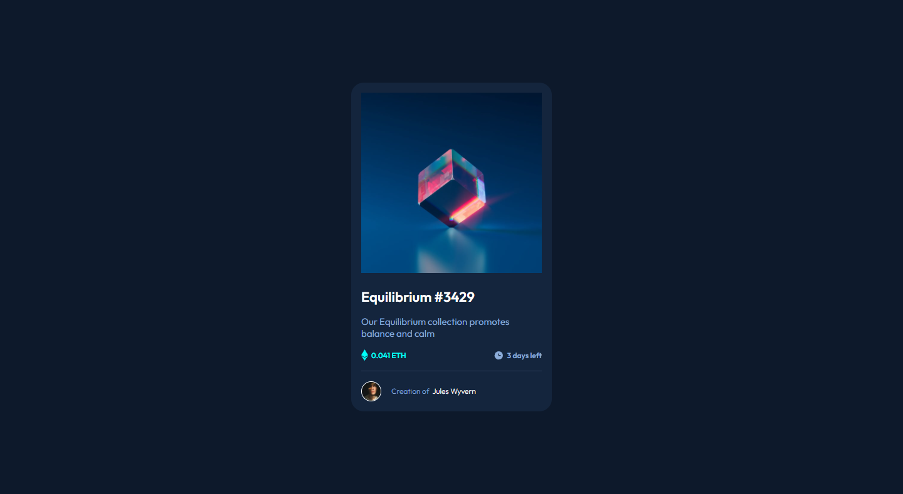
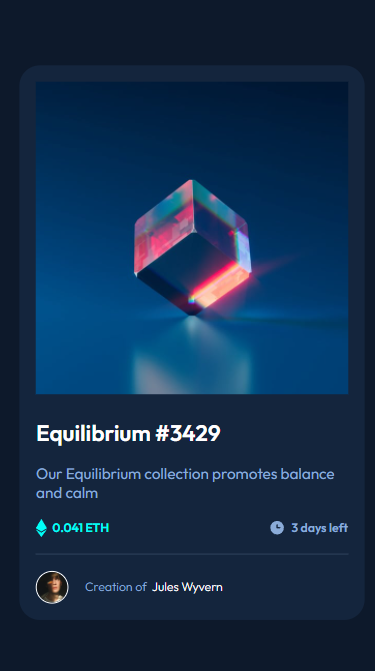

# Frontend Mentor - NFT Preview Card

This is a solution to the [NFT preview card component challenge hub](https://www.frontendmentor.io/challenges/nft-preview-card-component-SbdUL_w0U). Frontend Mentor challenges help you improve your coding skills by building realistic projects.

### Web Version

### Mobile Version

### Built with

- Semantic HTML5 markup
- CSS custom properties
- Flexbox
- JavaScript

## 🚀 Starting

To start the project, just open the file `index.html` in your preferred browser.

## Author

- Linkedin - [Linkedin](https://www.linkedin.com/in/danielbarbosadefreitas/)
- Frontend Mentor - [@Danielhu3](https://www.frontendmentor.io/profile/Danielhu3)
